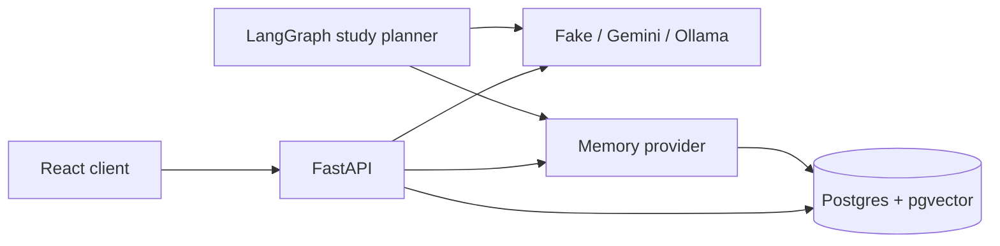

# MemoryAI

MemoryAI is a multi-user assistant that extracts small, user-controlled facts from conversations, retrieves only relevant facts later, and shows exactly what informed each reply.

## Run locally

1. Copy `.env.example` to `.env` and `backend/.env`, then set the same 32+ character `JWT_SECRET` in both files.
2. Run `docker compose up --build`.
3. Open `http://localhost:5173`; API docs are at `http://localhost:8000/docs`.

The default fake LLM and fake memory provider cost nothing and work offline. For meaningful semantic memory, select `MEMORY_PROVIDER=custom`, `EMBEDDING_PROVIDER=fastembed`, and a Gemini or small Ollama model.

## Architecture

The chat path retrieves top-ranked per-user memories, labels them as untrusted data in the prompt, streams the answer, saves an audit snapshot of memories used, then extracts future memories in the background. The Stage 12 study planner uses the same memory provider and makes a short grounded plan; it does not write memories by itself.

## Quality and security

- UUIDs and every repository query are scoped to the authenticated user; other users' records look like 404.
- Refresh tokens are hashed httpOnly cookies; access tokens remain in memory.
- Memory can be switched off per conversation or globally. The server re-checks before background writes.
- The sensitive-data guard rejects common password, token, key, card, and government-ID patterns before memory storage.
- Chat has a process-local per-minute limit and persisted daily request budget. Replace `InMemoryRateLimiter` with Redis for multi-instance deployment.

## Commands

- `docker compose up --build` — full local stack
- `cd backend && pytest` — backend suite
- `cd frontend && npm run typecheck && npm run build` — frontend verification

See `docs/memory-system.md`, `docs/decisions.md`, and `docs/interview-notes.md` for implementation trade-offs.
